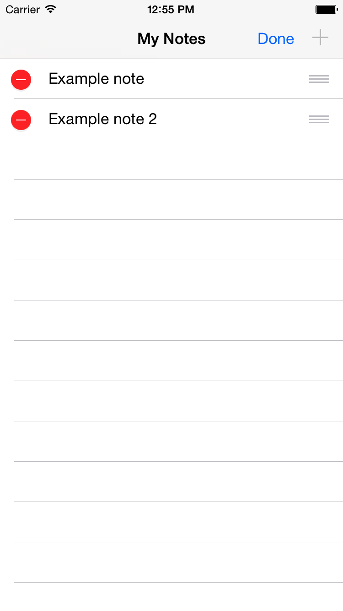

# My Notes
My Notes is a simple note-taking app. The user can also share their note on Twitter or Facebook.

For Twitter sharing, the app will truncate their note at 69 characters, if necessary, and add a '…' to the end.

### Screenshot

### Works on
The app is written in Swift 4, and should run on most devices running iOS 9 or later, with some potential exceptions, as some features may not be available in versions before iOS 11.

### Artwork
App icon is from http://www.iconarchive.com 
